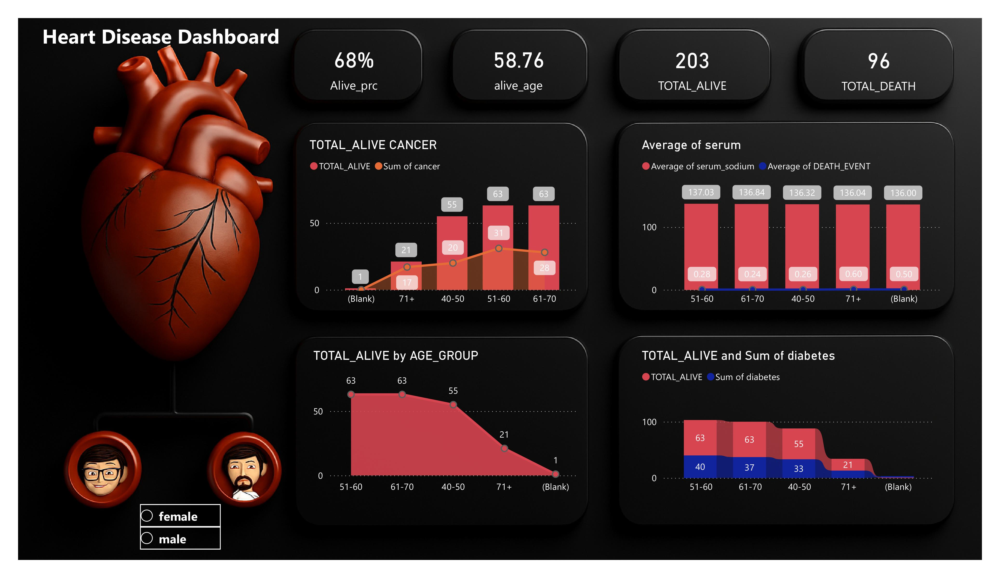

# Heart-Disease-Dashboard-Power-BI

## 📷 Dashboard Preview

An interactive Power BI dashboard that analyzes patient survival, age groups, and health factors like diabetes and cancer to deliver meaningful healthcare insights through dynamic visualizations and KPIs. ❤️📈
# ❤️ Heart Disease Dashboard | Power BI

## 📌 Overview
The Heart Disease Dashboard is an interactive Power BI project designed to analyze heart disease data and provide meaningful insights into patient survival, age distribution, and health-related factors such as diabetes, cancer, and serum sodium levels.

## 📊 Dashboard Features
- Total Alive and Total Death Analysis
- Survival Percentage KPI
- Average Age of Surviving Patients
- Age Group-wise Analysis
- Diabetes Impact Analysis
- Cancer Impact Analysis
- Serum Sodium Analysis
- Interactive and Modern Dashboard Design

## 🛠️ Tools & Technologies
- Power BI Desktop
- Power Query
- DAX
- Data Modeling
- Data Visualization

## 📈 Key Insights
- 68% of patients survived.
- Most surviving patients belong to the 51–70 age group.
- Diabetes and cancer significantly impact patient outcomes.
- Serum sodium levels show variations across different age groups.

# 🎯 Project Objective
To transform raw healthcare data into meaningful business intelligence and help identify trends that support data-driven healthcare decisions.

## 📂 Project Files
 Heart Disease Dashboard.xlsx
 Heart Disease Dashboard.pdf
 README.md
 
---
⭐ If you like this project, don't forget to star the repository!
